# PHP-Exercises
Database and Server-slide Development - PHP Exercises ( Online Class: Exercises )

Name: Abhisekh Ravlekar
PHP Exercises ( Online Class: Exercises )

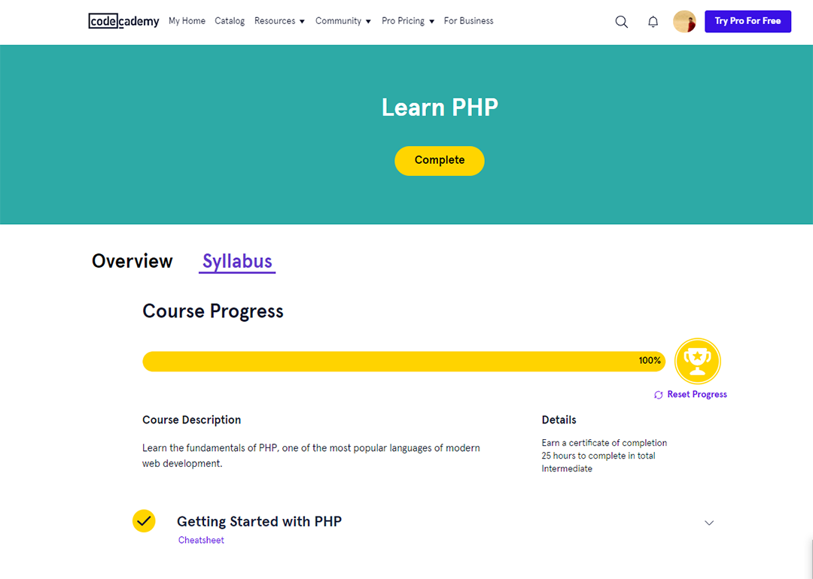
1_Getting-Started-with-PHP

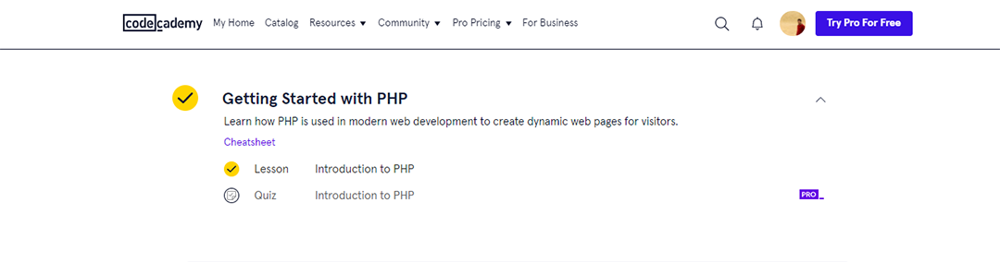

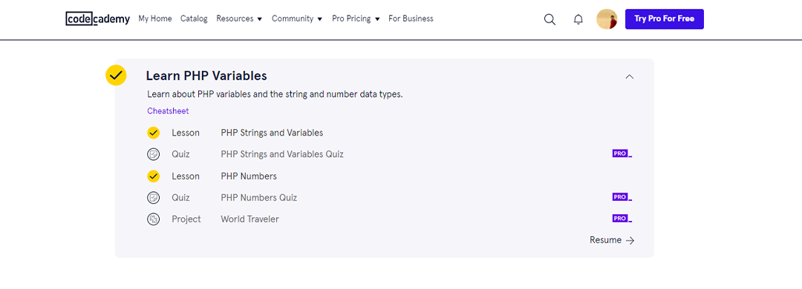

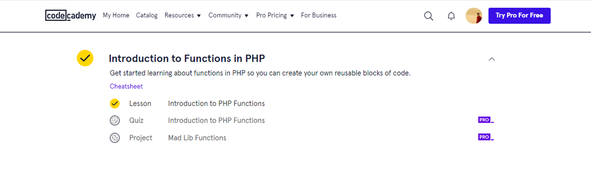

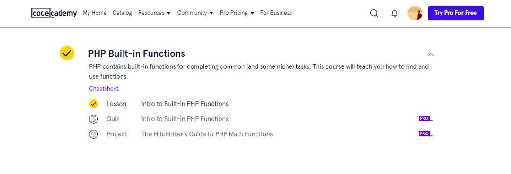

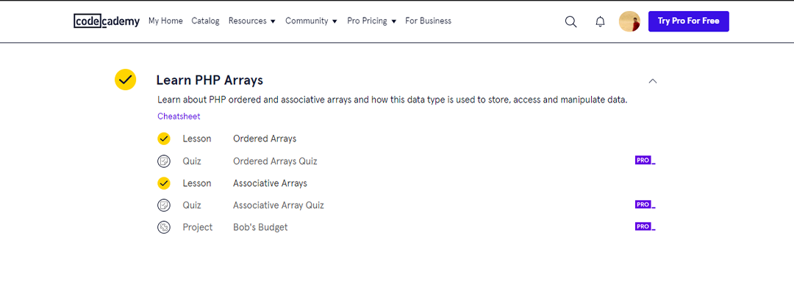

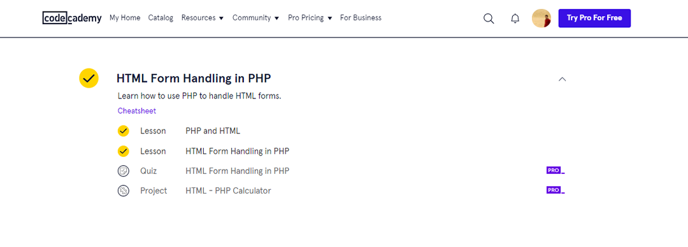

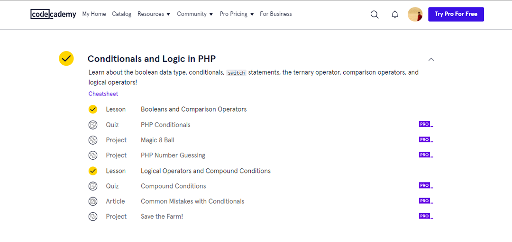

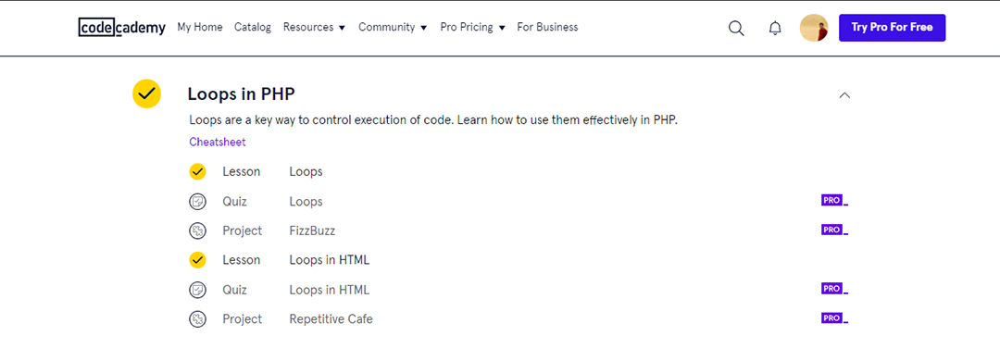

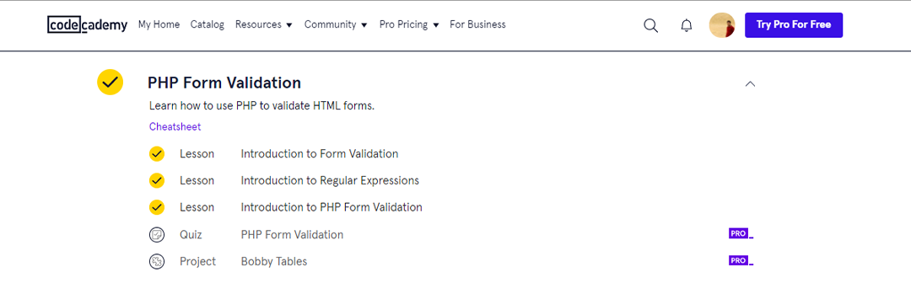

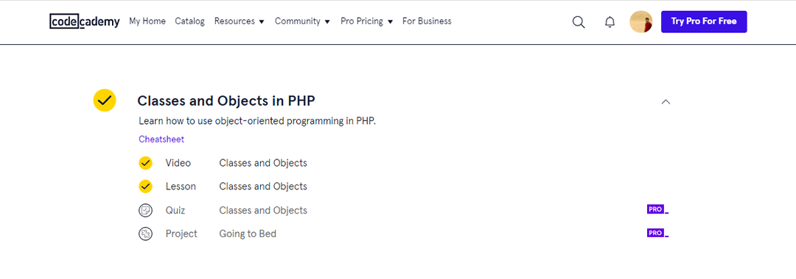

